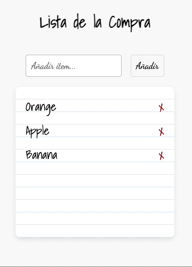

# 🛒 **Aplicación de Lista de la Compra: CRUD con JavaScript**

## 📝 **Introducción**

En este ejercicio, vamos a desarrollar una funcionalidad básica de una **lista de la compra** usando JavaScript. Esta lista permitirá gestionar los ítems que quieres añadir y eliminar, implementando las operaciones básicas de un CRUD (**Create, Read, Update, Delete**) sobre una lista en memoria del navegador.

- **Crear**: El usuario podrá añadir nuevos ítems a la lista.
- **Leer**: Al cargar la página, la lista mostrará los ítems existentes.
- **Eliminar**: Los ítems podrán ser eliminados individualmente.

La lista ya estará previamente creada con algunos ítems por defecto, y tu tarea será completar la funcionalidad de **visualizar**, **crear** y **eliminar** elementos.

Referencia:

## 🎯 **Objetivos de Aprendizaje**

1. **Manejo de DOM**: Aprender a manipular el DOM dinámicamente para crear, eliminar y actualizar elementos de la página.
2. **CRUD en Frontend**: Implementar las operaciones básicas de un CRUD, centrándose en las acciones de **creación**, **lectura** y **eliminación** de ítems.
3. **Manipulación de Arrays**: Practicar cómo manejar arrays en JavaScript para añadir, eliminar y filtrar elementos.
4. **Validación de Entradas**: Aprender a validar entradas del usuario para evitar duplicados o entradas vacías.
5. **Eventos en JavaScript**: Usar y gestionar eventos en JavaScript (por ejemplo, `click`) para interactuar con el usuario.

---

## 👁️‍🗨️ Historia de Usuario 1: Ver la lista de ítems

**Como** usuario, **quiero** ver una lista de todos los ítems que he añadido, **para** poder visualizar los artículos pendientes de gestionar.

### 🎯 **Criterios de Aceptación:**

1. La lista debe cargarse automáticamente cuando la aplicación se inicia.
2. Cada ítem debe mostrarse en su propio elemento `<li>`, con un botón de eliminar "x" a la derecha.
3. Si la lista está vacía, no se debe mostrar ningún ítem, pero el contenedor de la lista debe permanecer visible.
4. Los ítems deben aparecer en el orden en el que fueron añadidos.

---

## ➕ Historia de Usuario 2: Añadir un ítem a la lista

**Como** usuario, **quiero** poder añadir un nuevo ítem a la lista, **para** organizar y gestionar los artículos que necesito.

### 🎯 **Criterios de Aceptación:**

1. El usuario debe poder escribir el nombre de un ítem en un campo de entrada y hacer clic en el botón "Añadir" para agregarlo a la lista.
2. El ítem no debe añadirse si el campo de entrada está vacío.
3. Si el ítem ya existe en la lista, debe mostrarse un mensaje (alert o en pantalla) de advertencia indicando que el ítem ya está en la lista.
4. El ítem añadido debe guardarse con la primera letra de cada palabra en mayúscula y el resto en minúsculas (sin importar lo que se ha introducido).
5. Después de agregar el ítem, el campo de entrada debe vaciarse automáticamente.

---

## ❌ Historia de Usuario 3: Eliminar un ítem de la lista

**Como** usuario, **quiero** poder eliminar un ítem de la lista, **para** poder gestionar los artículos que ya no necesito.

### 🎯 **Criterios de Aceptación:**

1. Cada ítem debe tener un botón de eliminar ("x") junto a él.
2. Al hacer clic en el botón "x", el ítem debe eliminarse de la lista.
3. Después de eliminar el ítem, la lista debe actualizarse automáticamente.
4. No se debe pedir confirmación para eliminar el ítem; la eliminación es inmediata.

---

## 📦 **Entregables**

- Repositorio de GitHub con el código del proyecto.
- Página web desplegada en GitHub Pages con la funcionalidad completa.
